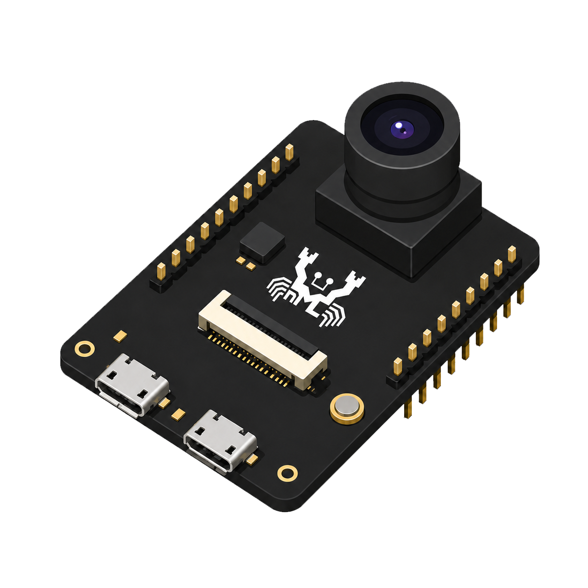
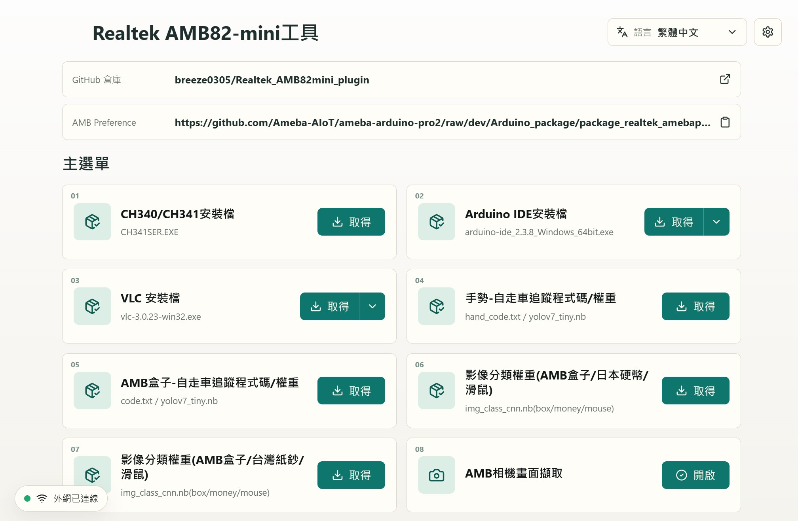

<div align="center">

<a href="#readme">
  
</a>

</div>

# Realtek AMB82-mini Computer Plugin

Realtek AMB82-mini Computer Plugin 是一款 Windows 桌面工具，用來協助 AMB82-mini 使用者快速取得開發所需檔案、開啟 AmebaPro2 套件資料夾、進行相機畫面擷取，以及檢查軟體版本。

This is a Windows desktop assistant for Realtek AMB82-mini developers. It helps with driver distribution, camera capture, bundled resource extraction, Realtek environment navigation, and update/download utilities.

本專案由舊版 Python CLI 工具重構而來，保留原本的核心功能，但改以 Tauri + React 桌面介面重新設計。新版不再要求使用者安裝 Python、OpenCV 或其他開發環境，並把原本的文字選單流程改成更直覺、輕量、可直接發佈的 Windows 應用程式。舊版程式碼仍保留在 `legacy/v2` 分支中。

## 畫面預覽



## 主要功能

- 取得 CH340/CH341 安裝檔。
- 取得手勢自走車追蹤程式碼與權重。
- 取得影像分類權重：
  - 硬幣 / 滑鼠 / 日本硬幣
  - 硬幣 / 滑鼠 / 台灣100紙鈔
- 下載 Arduino IDE 安裝檔；也可選擇自動安裝，下載 MSI 後以 Windows Installer passive 模式啟動安裝。
- 下載 VLC 安裝檔。
- 開啟本機 Realtek AmebaPro2 Arduino 套件資料夾。
- 開啟模型轉換網站：`https://modelconverter.ntnu-aiot.com/`
- AMB 相機畫面擷取：
  - 進入相機頁時自動掃描本機可用鏡頭
  - 下拉選單切換鏡頭
  - 即時預覽畫面
  - 可在相機頁選擇截圖輸出資料夾
  - 定時截圖並輸出為 `image_00001.jpg`、`image_00002.jpg` 等檔案
  - 內建 AMB82 mini UVC 相機設定教學
- 檢查 GitHub 上的最新版本。
- 顯示外網連線狀態；無外網時會停用需要網路的功能。
- 支援繁體中文、英文、日文介面。

## 使用方式

下載 release 版本後，直接執行：

```text
amb82-mini-computer-plugin.exe
```

若你的 Windows 10 電腦沒有 WebView2 Runtime，程式可能無法啟動。這種情況可改用安裝版，或先安裝 Microsoft Edge WebView2 Runtime。

> [!WARNING]  
> **此插件會依照設定頁選擇修改使用者的 AMB UVC device 格式，預設為 MJPG。每次打開插件時，都會自動覆寫 `UVCD_pram.h`。**

## 檔案輸出

檔案取得功能會開啟 Windows 存檔視窗，使用者可自行指定儲存位置。

相機擷取預設會在程式執行位置建立或使用：

```text
output/
```

也可以在相機頁按「選擇資料夾」指定 `output/` 要建立在哪個位置；例如選擇桌面後，照片會存到桌面底下的 `output/`。

截圖檔名會自動接續最大編號，避免覆蓋既有圖片。

## 開發技術

- Tauri 2
- React 18
- TypeScript
- Vite
- Rust

## 資源內容

程式內嵌並提供下列離線資源：

- `CH341SER.EXE`
- `gesture_recognition/hand_code.txt`
- `gesture_recognition/hand_weight.nb`
- `image_classification_japan/img_class_cnn.nb`
- `image_classification_taiwan/img_class_cnn.nb`


## 版本

目前版本：`3.7.2`

版本檢查來源：

```text
https://raw.githubusercontent.com/breeze0305/Realtek_AMB82mini_computer_plugin/main/version.txt
```

## 授權與注意事項

本工具用於輔助 Realtek AMB82-mini 開發流程。Arduino IDE、VLC、Realtek AmebaPro2 套件與相關第三方工具仍依各自官方授權與使用條款為準。

## 貢獻者

### 主要貢獻者

- NTNU Feng
- Email: benfeng99@gmail.com

### 共同貢獻者

- 賴彥廷
- 范哲瑋
- 陳柏序
- 李易修
- 黃琮善
- 陳品妤
- 余品誼
- 李鍇灝
- 吳祐安
- 王威達
- 吳子安
